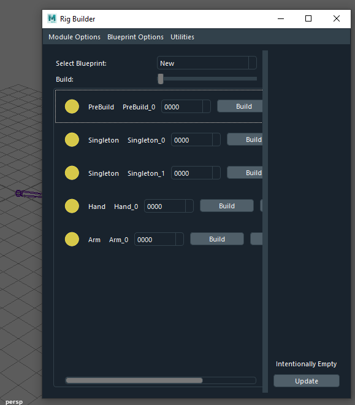
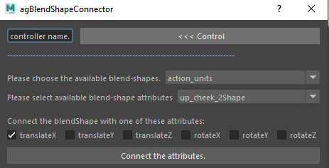

# Maya Python Work Repository
---

In this repository I saved my pipeline development work in case I lose all my work.

## What's in it

Home repository of projects that I work from home. I code with OpenMaya 1.0 because it is closer to Maya C++ style of coding.

I have encapsulated the OpenMaya.MScriptUtil module in a class object so that I can easily source pointer objects.

Lots of _rigging_ utility modules to help me solve problems relating to the projects I work on better.

### General Function Return:

  Unlike the standard C++ of return 0 which denotes as return of no problems.

  In here, each function returns _bool_ True for success. and _bool_ False for failure. This is to signify that the function has been called and run successfully. This is useful for unit test purposes.

### The maya_utils:

In this directory I store anything relating to manipulation of Maya objects inside the scenes.

* animation_utils  -- Animation data tools, manipulating animation settings.
* attribute_utils  -- Attribute module for finding, creating and setting transform attributes.
* file_utils       -- Creating and reading file objects, as well as manipulating the maya files.
* math_utils       -- Standard math functions and manipulating vector operations.
* object_utils     --  Manipulating and traversing the Maya scene objects and connections.
* transform_utils  --  Transform module for finding, creating and setting attributes
* ui_utils -- Maya interface tools.
* curve_utils -- MFnNurbsCurve utility functions.
* follicle_utils -- Follicle creation module.
* mesh_utils -- Mesh data tools.

### The rig_utils

In this directory I store anything relating to the utility of rigging.

* control_utils -- Creation of kNurbsCurve control objects.
* joint_utils -- Creation of kJoint objects.
* name_utils -- Getting and retrieving nomenclature data.

### The deformers

In this directory I manipulate the deformers within the Maya application.

* skincluster_utils -- Querying, getting and setting skin-cluster information.

### The tools

All of the utilities I wrote are to support a variety of available tools:

* agRigBuilder -- Creation of rig modules.

* agBlendConnect -- Connection of available blendshapes using attributes.

